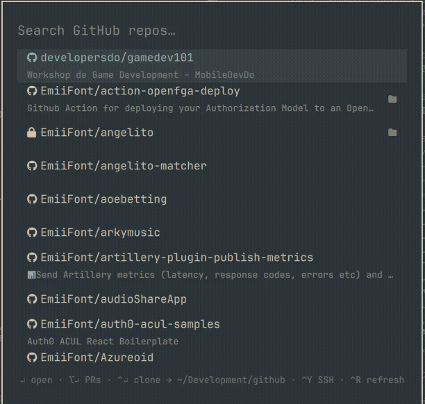

# omarchy-github-search

[](https://github.com/EmiiFont/omarchy-github-search/actions/workflows/ci.yml)
[](LICENSE)

A GitHub repository search launcher for the [Omarchy](https://omarchy.org)
shell. Summon a themed overlay, fuzzy-search every repo you own or can access
through your orgs, and open, clone, or copy the selection without leaving
your keyboard.

```bash
omarchy plugin add https://github.com/EmiiFont/omarchy-github-search.git --enable
```



## Features

- **Type-anywhere fuzzy search** over your repos, org repos, and
  collaborations — name matches rank above description matches
- **Enter** opens the repo in your browser, **Alt+Enter** jumps straight to
  its pull requests
- **Ctrl+Enter** clones it (`gh repo clone`) into a configurable directory,
  with a desktop notification on success, failure, or already-cloned
- **Ctrl+Y** copies the SSH clone URL — the overlay stays open so you can
  grab several in a row
- A folder badge marks repos that already exist in your clone directory
- Instant startup: the repo list is cached locally and only re-fetched when
  the cache is stale (configurable; **Ctrl+R** forces a refresh)
- Actionable empty states: tells you exactly what to run if `gh` is missing
  or unauthenticated
- Styled with your Omarchy theme's menu tokens — it matches whatever theme
  you run

## Requirements

- Omarchy with the Quickshell-based shell (`omarchy-shell`)
- [`gh`](https://cli.github.com/) — authenticated (`gh auth login`); all
  GitHub access happens through your own `gh` credentials
- `python3`, `bash`, `notify-send`, `xdg-open`, `wl-copy` (all preinstalled
  on a stock Omarchy install; only `gh` usually needs installing)

## Install

```bash
omarchy plugin add https://github.com/EmiiFont/omarchy-github-search.git --enable
```

Then bind a key in `~/.config/hypr/bindings.lua`:

```lua
o.bind("SUPER + SHIFT + I", "GitHub repo search", "omarchy-shell shell toggle emiifont.github-search")
```

Or add it to the Omarchy menu in `~/.config/omarchy/extensions/omarchy-menu.jsonc`:

```jsonc
"github": {"icon": "", "label": "GitHub repos", "action": "omarchy-shell shell toggle emiifont.github-search"},
```

Or summon it manually:

```bash
omarchy-shell shell toggle emiifont.github-search
```

To remove: `omarchy plugin remove emiifont.github-search` (the local repo
cache at `~/.cache/omarchy-github-search/` can be deleted too).

## Keys

| Key             | Action                                     |
|-----------------|--------------------------------------------|
| type            | Filter repos                               |
| `↑` `↓` `PgUp` `PgDn` | Navigate results                     |
| `Enter`         | Open selection in browser                  |
| `Alt+Enter`     | Open selection's pull requests page        |
| `Ctrl+Enter`    | Clone selection into `cloneRoot`           |
| `Ctrl+Y`        | Copy SSH clone URL (overlay stays open)    |
| `Ctrl+R`        | Force-refresh the repo list                |
| `Escape`        | Clear query, then close                    |

Mouse: click opens; Ctrl+click clones; Alt+click opens pull requests.

## Configuration

Optional. Create `~/.config/omarchy/github-search.json`:

```json
{
  "cloneRoot": "~/Development/github",
  "refreshMinutes": 15
}
```

| Key              | Default                | Purpose                                                        |
|------------------|------------------------|----------------------------------------------------------------|
| `cloneRoot`      | `~/Development/github` | Directory Ctrl+Enter clones repos into                         |
| `refreshMinutes` | `15`                   | Re-fetch on open only if the cache is older than this; `0` re-fetches every open |

## How it works

The QML overlay is a thin view; all logic lives in `github-search-helper.py`,
a Python coprocess (standard library only) that the overlay starts on first
open and talks to over a JSON-lines stdin/stdout protocol:

```
GithubSearch.qml (view)                github-search-helper.py (logic)
  {"cmd":"filter","query":"..."}  ──►  fuzzy-filter + rank cached repos
  {"cmd":"refresh","force":bool}  ──►  gh api user/repos (if cache is stale)
  {"cmd":"open","url":"..."}      ──►  xdg-open
  {"cmd":"clone","name":"o/r"}    ──►  gh repo clone + notify-send
  {"cmd":"copy","name":"o/r"}     ──►  wl-copy git@github.com:o/r.git
  rows / status / config lines    ◄──  responses as JSON lines
```

On start the helper serves the cache at
`~/.cache/omarchy-github-search/repos.json` instantly, then refreshes it in
the background from
`gh api user/repos?affiliation=owner,organization_member,collaborator` —
but only when the cache is older than `refreshMinutes`. Filtering is local,
so nothing hits the network per keystroke. The helper exits when the shell
closes its stdin, and is additionally bound to the shell's lifetime via
`setpriv --pdeathsig`.

## Testing

```bash
python3 -m unittest discover -s tests -v   # unit + protocol tests
python3 tests/check_manifest.py            # manifest contract check
```

CI runs both on every push and pull request.

## Security

Omarchy shell plugins run unsandboxed inside your long-lived `omarchy-shell`
process with your user permissions. This plugin executes exactly five kinds
of external commands, all from the Python helper: the `gh api` fetch
described above, `gh repo clone` on Ctrl+Enter, `wl-copy` on Ctrl+Y, and
`xdg-open`/`notify-send` for opening and notifications. It never sends your
data anywhere; review the source — everything that makes a decision is in
`github-search-helper.py`.

## License

[MIT](LICENSE)
