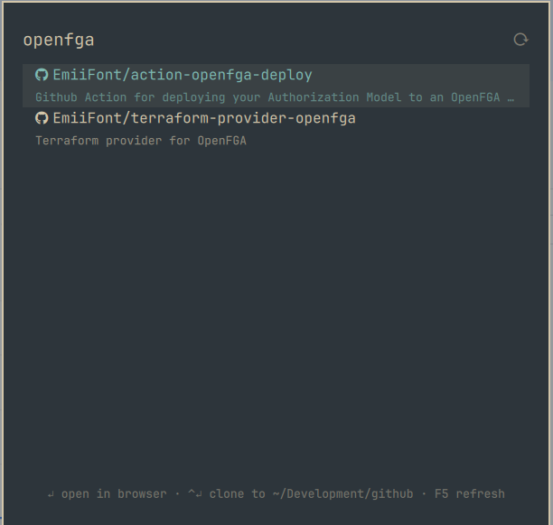

# omarchy-github-search

A GitHub repository search launcher for the [Omarchy](https://omarchy.org)
shell. Summon a themed overlay, fuzzy-search every repo you own or can access
through your orgs, and open or clone the selection without leaving your
keyboard.



## Features

- **Type-anywhere fuzzy search** over your repos, org repos, and
  collaborations — name matches rank above description matches
- **Enter** opens the repo in your browser
- **Ctrl+Enter** clones it (`gh repo clone`) into a configurable directory,
  with a desktop notification on success, failure, or already-cloned
- **F5** re-fetches the repo list; **Escape** clears the query, then dismisses
- Instant startup: the repo list is cached locally and refreshed in the
  background every time the overlay opens
- Styled with your Omarchy theme's menu tokens — it matches whatever theme
  you run

## Requirements

- Omarchy with the Quickshell-based shell (`omarchy-shell`)
- [`gh`](https://cli.github.com/) — authenticated (`gh auth login`); all
  GitHub access happens through your own `gh` credentials
- `jq`, `bash`, `notify-send`, `xdg-open` (all present on a stock Omarchy
  install; only `gh` usually needs installing)

## Install

```bash
omarchy plugin add https://github.com/EmiiFont/omarchy-github-search.git --enable
```

Then bind a key in `~/.config/hypr/bindings.lua`:

```lua
o.bind("SUPER + SHIFT + I", "GitHub repo search", "omarchy-shell shell toggle emiifont.github-search")
```

Or summon it manually:

```bash
omarchy-shell shell toggle emiifont.github-search
```

## Configuration

Optional. Create `~/.config/omarchy/github-search.json`:

```json
{
  "cloneRoot": "~/Development/github"
}
```

| Key         | Default                | Purpose                                  |
|-------------|------------------------|------------------------------------------|
| `cloneRoot` | `~/Development/github` | Directory Ctrl+Enter clones repos into  |

## Keys

| Key             | Action                          |
|-----------------|---------------------------------|
| type            | Filter repos                    |
| `↑` `↓` `PgUp` `PgDn` | Navigate results          |
| `Enter`         | Open selection in browser       |
| `Ctrl+Enter`    | Clone selection into `cloneRoot`|
| `F5`            | Refresh the repo list           |
| `Escape`        | Clear query, then close         |

## How it works

On open, the plugin runs
`gh api user/repos?affiliation=owner,organization_member,collaborator`
(paginated) in the background, caches the result at
`~/.cache/omarchy-github-search/repos.json`, and serves the cache instantly
on subsequent opens. Filtering is local, so nothing hits the network per
keystroke. Cloning shells out to `gh repo clone` detached from the shell
process.

## Security

Omarchy shell plugins run unsandboxed inside your long-lived `omarchy-shell`
process with your user permissions. This plugin executes exactly three kinds
of external commands: the `gh api` fetch described above, `gh repo clone`
when you press Ctrl+Enter, and `xdg-open`/`notify-send` for opening and
notifications. It never sends your data anywhere; review the source — it is
three small files.

## License

[MIT](LICENSE)
